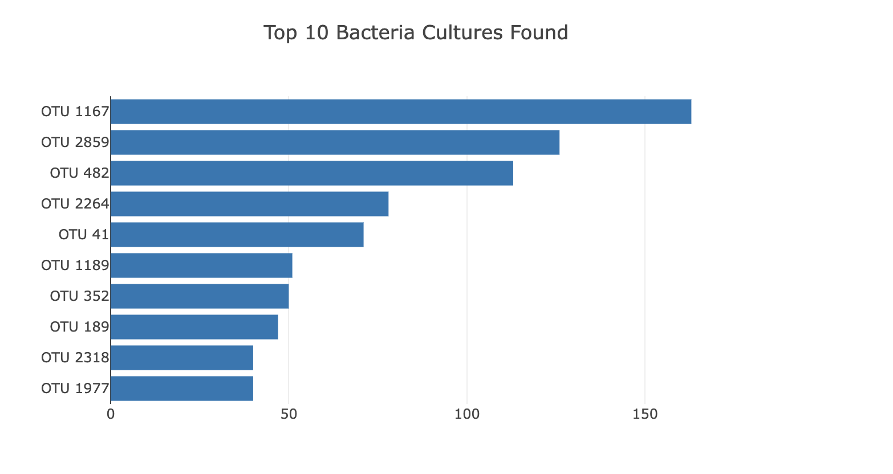
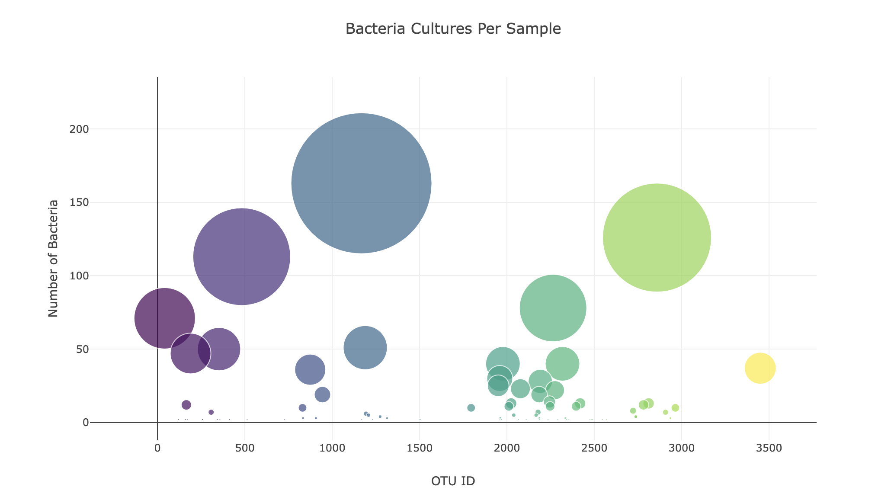
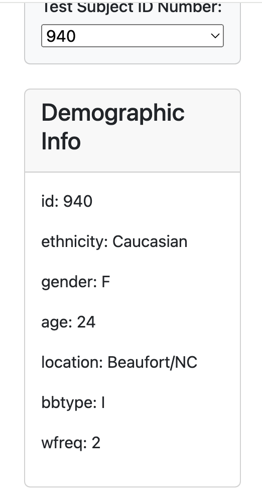

# belly-button-challenge

Project Title: Belly button challenge
Description: 
1. Top 10 bacteria culture found in each individual in distribution format;
2. Integrated bubble chart for bacteria culture per sample;
3. Each individual metadata;
Data Source: provided JSON file in samples.json data
Technologies Used: HTML, CSS, JavaScript, D3.js, Plotly
Screenshots: 
Plot 1:

Plot 2:

plot 3:
